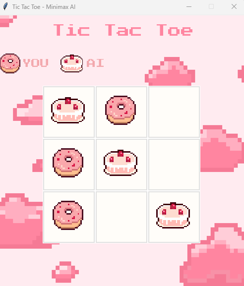
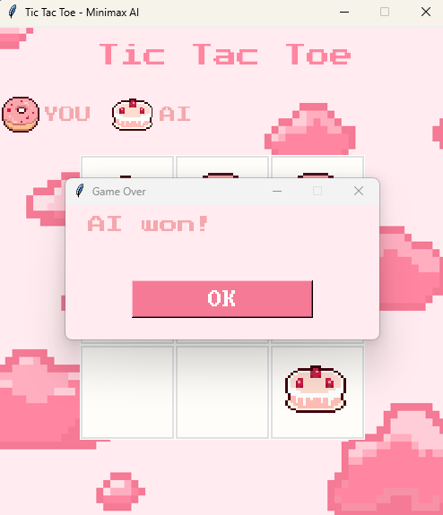

# Tic Tac Toe – Minimax AI
A Python-based Tic Tac Toe game built using Tkinter with an AI player powered by the Minimax algorithm.  
The AI uses the Minimax algorithm, which simulates all possible game states and picks the move that maximizes its chance of winning while minimizing the player's chance.

This guarantees the AI will never lose.

# Features
- Play against an unbeatable Minimax AI 
- Pixel-art themed design

# Screenshots

  


# How to Run the Game

1. Install Python
2. Install required library:
```bash
pip install pillow

3. Run the game script:
python tictactoe.py


